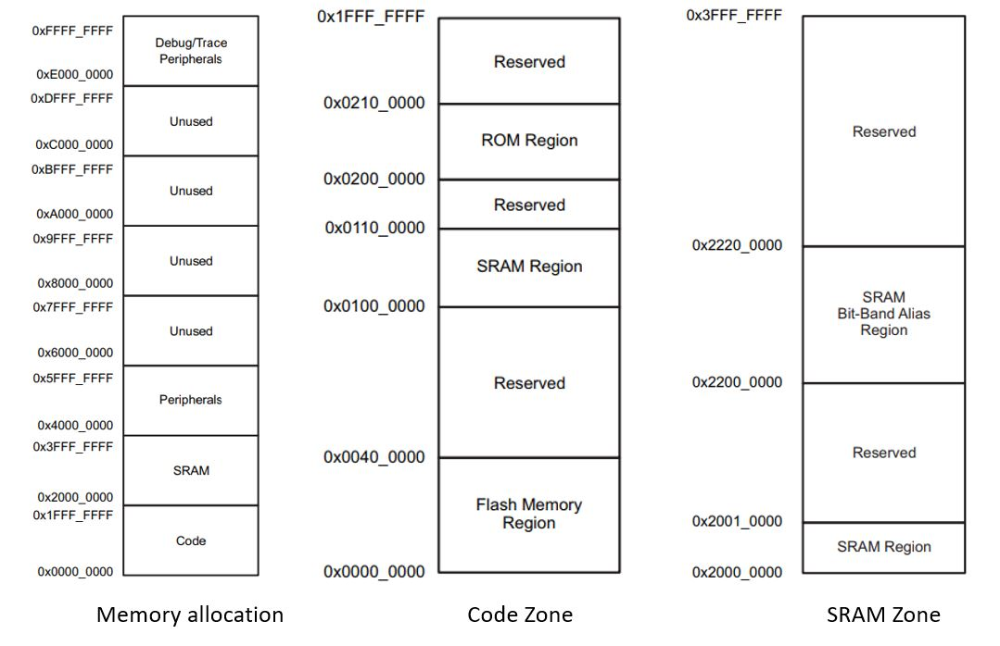
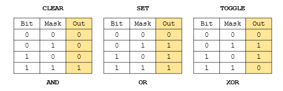
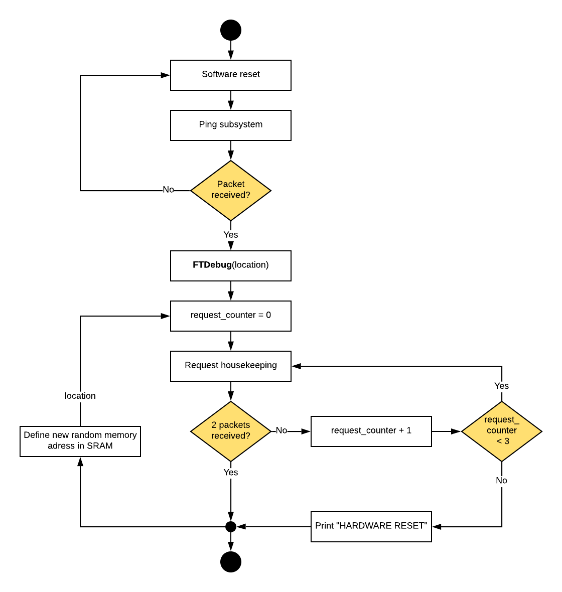
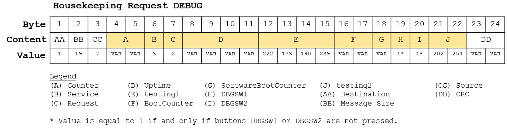
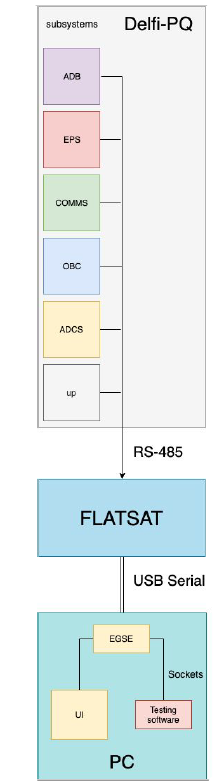
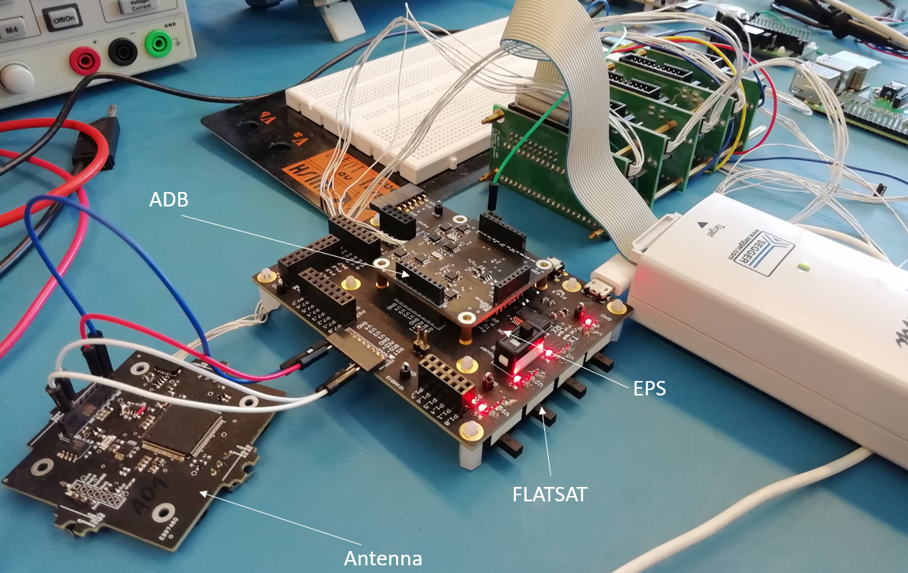
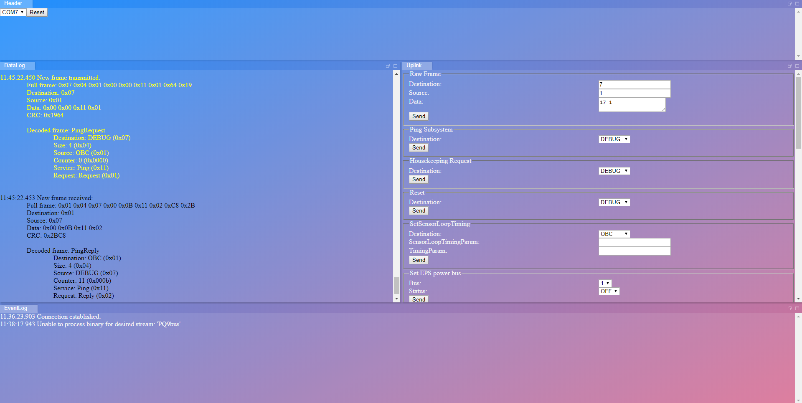

# FDIR_PQ9

## Purpose
Delft University of Technology is currently developing the [Delfi-PQ](https://www.tudelft.nl/lr/subsites/delfi-space/delfi-pq/), a 3U PocketCube spacecraft, expected to launch in 2019. Throughout its mission, Delfi-PQ will be in a severe radiation environment in low Earth orbit, which could potentially harm the spacecraft electronics. The radiation effect focussed on in the present work is the Single Event Upset (SEU), which origins from ionizing parcles interacting with the spaccraft electronics. The SEU is a soft error (recoverable) with unpredictable consequences. One of the consequences of SEUs are changes in memory locations, which could result in retrieving incorrect housekeeping data from the spacecraft. 

Clearly SEUs should be corrected for, which is normally done by an on-board Fault Detection, Isolation and Recovery (FDIR) algorithm. FDIR algorithms are vital for the correct in-orbit operation of the Delfi-PQ and hence shall be tested extensively on Earth to validate correct function. For large spacecraft, this is often done by using radiation hardened electronics or by testing the flight computer in a radiation environment. Both these options add a lot of cost to the overal mission, which is often not possible for small spacecraft, such as Delfi-PQ. Therefore, **the purpose of this repository is to simulate SEUs by means of real time fault injection, in an attempt to validate the Delfi-PQ FDIR algorithm**. 

The repository is made open-source and allows students from all over the world to contribute to the project. 


## Design
### Literature Overiew
In the past, several attempet were already made on developing to develop a FDIR validation simulation, which have been used throughout this work as a reference. Firstly, [Delfi-PQ_FDIR](https://github.com/JochimM/Delfi-PQ_FDIR), uses an Arduino to simulate the spacecraft. Errors are only injected in the SRAM memory and communication is done via standard USB serial. Error checking is done by asking housekeeping data, which contains the names of the authors as well as the borwein pi approximation. Since both housekeeping parameters are fixed and can be well modelled, the authors can check for errors in the received data. Their simulations oututs a memory map of the memory loction and specific bits in which soft errors (wrong housekeeping data) and hard errors (Arduino crash) occur. For further iterations of the software, they recommend ...... **WRITE WHAT WE IMPLEMENTED**

Another attempt was made in the [Delfi-PQ_FDIR_Evaluator](https://github.com/FlyOHolic/Delfi-PQ_FDIR_Evaluator), 


Although work has already been done on this in the past, what is new to this repository is that it includes the DELFI-PQ
PQ9 communication protocol for the simulation of SEUs. For more information regarding the PQ9 protocol used, the reader is refered to the [PQ9 and CS14 interface standard](https://dataverse.nl/dataset.xhtml?persistentId=hdl:10411/3V8RUF). Earlier iterations of the SEU simulation tool, such as 


### Single Event Upsets
Single Event Upsets (SEU) are a type of recoverable error (soft errors) which origin from ionizing parcles interacting
with the spaccraft electronics. SEUs occur in all Bipololar, CMOS or BiCMOS technologies, except in EEPROM or flash 
EEPROM. In the present work, SEUs are modelled through bitflips in memory cells or registers of the electronics. 
The Texas Instruments MSP432P401R LaunchPad is used to run the onboard commands of the DELFI-PQ. This board has the 
following memory allocation:

<p align="center">
  
</p>

In the present work we only model SEUs in the SRAM of the board, which located in 0x0100000 up to 0x01100000 (1,048,576 
up to 17,825,792) and in 0x2000000 up to 0x3FFFFFFF (33,554,432 up to 53,687,091). 

[old range]
Here, the effects of SEUs in the SRAM shall be considered, which for MSP432 is located in memory address 
range 0x2000 0000 to 0x2010 0000. 

<p align="center">
  
</p>


A Cyclic Redundancy Check is implemented in the PQ9 communication protocol to account for errors during data transfer. When an error during data transfer occur, the EGSE application programming interface automatically rejects the packet. Hence, when running the **client_adb.py**, no packet will show up. To counteract this, a housekeeping loop is implemented, called, which transmist a housekeeping request op to three times when no packet is received. The flowchart used for this is shown below:

<p align="center">
  
</p>


### Error Determination
After errors are introduced in the system, it is of interest if these errors indeed propagate through the system or if
the FDIR system sucesfully resolves the error. After introducing a SEU in the memory, we distinguish four different 
errors:

* Corrupted data, corrected by the on-board FDIR (voting etc.). 
* Corrupted data, not corrected by the on-board FDIR.
* Freeze of the system, corrected by the on-board FIDR (watchdog timer).
* Freeze of the system, not corrected by the FDIR. 

Of course, the last state is one we do want to prevent for space missions, as this could potentially mean the loss of 
the systen, as in this state no communication with the vehicle is possible anymore, without a reset of the software. 

The latter two errors are easy to detect with the SEU algorithm. After a freeze of the system has occured, the board 
will no long transmit packets and does not respond to software inputs anymore. This can only be resolved by manually 
pressing the reset button on the board, as no watchdog timer is implemented in the on-board software used in the present
work. 

However, decting corrupted data is much harder, as this requires a reference to compare the data packets with. For this
we first need to get a better understanding of the communication protocol used on the DELFI-PQ, the PQ9 protocol. The 
PQ9 protocol sends data in the form of packets, where the minimum packet length is 5 bytes and the maximum packet length
is 255 bytes, based on the 8-bit architecture. The first byte contains the receiver to which the packet is sent, 
the second byte the size of the message transmitted, the third byte contains the transmitter and finally the last two 
bytes contain a Cyclic Redundancy Check, which is used to verify if errors in the message have occured during tranmission.
A schematic overview of a packet for the housekeeping debug service is shown below, where the message is highlighted:

<p align="center">
  
</p>

The message contains the housekeeping information of the particular subsystems of DELFI-PQ. The output in the DEBUG 
mode is mainly constant, but also consists of some variable bytes (bytes which change over time). The decimal values 
for the constant bytes when invoking a DEBUG housekeeping request are shown in the figure above. The packets returnd by invoking an ADB housekeeping request when conncted to the FLATSAT are larger, but still contain variable bytes for the counter and fixed bytes representing testing 2 (0xcafe) and testing 4 (0xdeadbeef). The counter will be used to identify missing packages, while testing 2 and testing 4 will be used to check the data produced by housekeeping is not corrupt 

<!--- All bytes with a variable value can be computed in PYTHON, and are either integer counters or timer values.  Once these variable values are computed, they can be used to create a reference message, together with the constant value bytes. This constructed reference message can in term be used to compare against the received message to check for corrupted data errors. --->

We assume that during the transmission no errors in the data are introduced, and that the errors that are introduced
during the tranmission are corrected for by the Cyclic Redundancy Check built in the packet. 

It should be noted that this comparison method works only for simple data packets, such as the DEBUG housekeeping request.
This is because all variables in the DEBUG subsystem are well predictable. For other subystems, this becomes more tricky
since the data stored in the packets can be highly variable in time, and non-predictable (e.g. the voltage on a battery
of the EPS subsystem). 


## How to Use  
### Prerequisites
To transmit or receive data to or from the Delfi-PQ, the the following items are required:

* Computer running on either Windows or LINUX, with **Python 2.7** installed. 
* Texas Instruments [MSP432P401R LaunchPad](http://www.ti.com/tool/MSP-EXP432P401R)
* Micro USB to USB C cable. 
* Delfi-PQ subsystems (if being tested). 

### Hardware Overview
Testing of the FDIR of the different subsystems on-board of Delfi-PQ can be done in a modular way, by adding and removing different subsystems to the test environment, as shown in the figure below. 

<p align="center">
  
</p>

First, the user can select the subsystems to test the FDIR from, by attaching different Delfi-PQ subsystems to to FLATSAT. Communication is done via the RS-485 serial interface. The FLATSAT is a developer board used to connect the Delfi-PQ subsystems to the computer for validation testing. In the present work, the Texas Instruments LaunchPad is used as the FLATSAT interface. Commnication with the computer is done via USB serial. 

On the computer one uses the EGSE application programing interface to transmit and receive data to the Delfi-PQ, via the FLATSAT. Outside the the EGSE GUI, in which the user can commmunicate the Delfi-PQ with in GUI inveronment, the user can also use Python to communicate with Delfi-PQ. The latter gives more flexibility in the testing software that can be used, since the EGSE GUI has limited testing options available. 

For the real subsystem, the FLATSAT is used instead, with the ADB subsystem. This setup connected is shown in the figure below. 

<p align="center">
  
</p>


### Software Setup
Download this repository and store it on your computer. Connect the FLATSAT to the computer using the micro USB to USB C cable (a green LED should now blink on the board). When using Windows, open Windows PowerShell in administrator mode and run the following command:
```
cd C:\...\FDIR_PQ9\PQ9EGSE
java -jar target/PQ9EGSE-0.1-SNAPSHOT-jar-with-dependencies.jar
```
where the dots are to be replaced with the repository directory. When using LINUX, open the terminal and run the following command:
```
cd FDIR_PQ9\PQ9EGSE
sudo java -jar target/PQ9EGSE-0.1-SNAPSHOT-jar-with-dependencies.jar
```

Both cases will load the EGSE application programing interface. This can now be accessed by going to the internet browser and  typing in the adress bar:
```
localhost:8080
```

This will bring you to the EGSE GUI, as shown in the picture below. In the header, define the serial port used by the FLATSAT (COM7 in the figure). Note that one of the ports if for serial communication, and the other only for programming. 

<p align="center">
  
</p>

One can test if a sucesfull connection is obtained by sending a ping to **DEBUG** if connected to the TI MSP342 or to **ADB** if connected to the PQ hardware. In the DataLog on the left side of the screen, a transmitted message should now prompt in yellow, as well as a received message in black. 

Running the Python testing software is done via the **client_adb.py** when connected to the PQ hardware, or **client_ti.py** for testing the code wth TI board. One can open any Python 2.7 editor (e.g. IDLE) to open this file and run it. Additionally, one can also run the script diretly via Windows Powershell or LINUX terminal when using the command:

```
cd FDIR_PQ9\PQ_integretion_testing
python client_adb.py
```
In both the EGSE software and the python files, the memory address must be input in decimal, for which the range is 
536,870,912 to  537,9191,488. At present **client_adb.py** looks in the range of 536864505 to 536884505, but this can be increased. 

All the addresses tested are recorded in .json files, to ensure no data is lost if the python crashes. These are located in the folder address_logs. The types of errors occuring at the varying memory locations can be plotted using the **error_graphs.py** file. This is the files used to produce the results in the following section.  

```
python error_graphs.py
```


## Results

<p align="center">
  
</p>

## Issues Encountered 
When a SEU is sent to some particular memory locations, the microcontroller fully "freezes" and communication with the
board is no longer possible. This state could only be recovered from by pressing the physical reset button on the board.
However, this is not practical in reality if one wants to test the full memory spectrum. Therefore, it is recommended
to implement a watchdog timer on the board to let it reset by itself if no response is detected. 


## Recommendations
* Currently, the testing software is only compatible with Python 2.7. This version is already qutie old and noweadays Python 3.0 is used for most programming applications. Therefore, to keep the testing software future-proof, it is recommended to make the code compatible for both Python 2.7 and Python 3.
