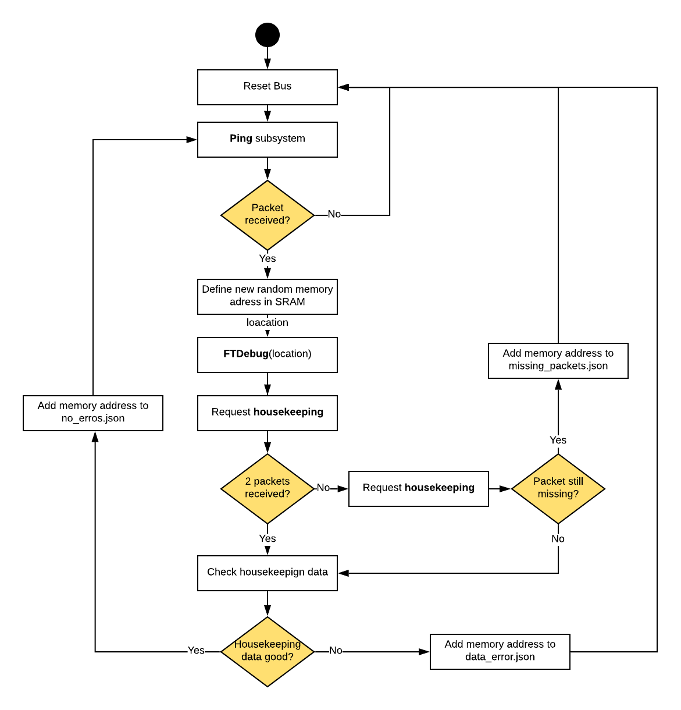

# Delfi-PQ Fault Injection Software

* [1. Purpose](#1-purpose)
* [2. Repoistory Overview](#2-repository-overview)
* [3. Design](#3-design)
* [4. How to use](#4-how-to-use)
* [5. Results](#5-results)
* [6. Issues Encountered](#6-issues-encountered)
* [7.Recommendations](#7-recommendations)


## 1. Purpose
Delft University of Technology is currently developing the [Delfi-PQ](https://www.tudelft.nl/lr/subsites/delfi-space/delfi-pq/), a 3U PocketCube spacecraft, expected to launch in 2019. Throughout its mission, Delfi-PQ will be in a severe radiation environment in low Earth orbit, which could potentially harm the spacecraft electronics. The radiation effect focused on in the present work is the Single Event Upset (SEU), which origins from ionizing particles interacting with the spacecraft electronics. The SEU is a soft error (recoverable) with unpredictable consequences. One of the consequences of SEUs are changes in memory locations, which could result in retrieving incorrect housekeeping data from the spacecraft. 

Clearly SEUs should be corrected for, which is normally done by an on-board Fault Detection, Isolation and Recovery (FDIR) algorithm. FDIR algorithms are vital for the correct in-orbit operation of the Delfi-PQ and hence shall be tested extensively on Earth to validate correct function. For large spacecraft, this is often done by using radiation hardened electronics or by testing the flight computer in a radiation environment. Both these options add a lot of cost to the overall mission, which is often not possible for small spacecraft, such as Delfi-PQ. Therefore, **the purpose of this repository is to simulate SEUs by means of real time fault injection, in an attempt to validate the Delfi-PQ FDIR algorithm**. 

The repository is made open-source and allows students from all over the world to contribute to the project.

## 2. Repository Overview
In addition to the Readme, there are a few main files required to run the software. In the **fault_injection** folder there are two main files:

* **client_ti.py** the Python file to analyse the MSP432P401R LaunchPad.
* **client_adb.py** the Python file to analyse the FLATSAT ADB.

And in the **PQ9EGSE** folder there are two main files:

* **target/PQ9EGSE-0.1-SNAPSHOT-jar-with-dependencies.jar** the java file which deploys the EGSE software.
* **EPS.xml** contain the definitions of all the requests that can be sent to the board.

Other files of note in the **fault_injection** folder are:

* **error_graphs.py** creates a graph of the error locations.
* **pq_comms.py** defines the requests as functions which can be executed with Python.
* **testing.txt** logs all the packets returned by the board.

Lastly, the folder **figures** contains all figures used in this documentation. 

## 3. Design
### 3.1 Literature Overiew
In the past, several attempts were already made on developing a FDIR validation simulation, which have been used throughout this work as a reference. Firstly, [Delfi-PQ_FDIR](https://github.com/JochimM/Delfi-PQ_FDIR), uses an Arduino to simulate the spacecraft. Errors are only injected in the SRAM memory and communication is done via standard USB serial. Error checking is done by asking housekeeping data, which contains the names of the authors as well as the Borwein pi approximation. Since both housekeeping parameters are fixed and can be well modelled, the authors can easily check for data corruption as a result of the faults injected. Their simulations outputs a memory map of the memory location and specific bits in which *soft errors* (corrupted housekeeping data) and *hard errors* (Arduino crash) occur. 

Another attempt was made in the [Delfi-PQ_FDIR_Evaluator](https://github.com/FlyOHolic/Delfi-PQ_FDIR_Evaluator), where the authors used two Texas Instruments MSP432P401R LaunchPad development boards, which is identical to the development board used in the present work. They use Python to inject error in the SRAM zone of the memory (0x20000000-0x20100000). Their board is programmed to continuously transmit the message "Hello World", which can have a different output if errors are introduced in the board. They distinguish four types of errors of which the two most relevant are: (1) *lockup* in which the boards stops responding and (2) *data corruption* in which the outputted "Hello World" string is corrupted.

### 3.2 Memory Overview
To simulate created errors due to SEUs the approach used in this work injects failures in the memory of the Delfi-PQ. The on-board memory is modelled with the FLATSAT interface or the MSP432P401R LaunchPad, which both have the same microcontroller. The memory map for the particular microcontroller used is shown in the figure below (source: [Texas Instruments](http://www.ti.com/lit/ds/symlink/msp432p401r.pdf)). 

<p align="center">
  
</p>

Like the previous iterations of the FDIR evaluation software, the errors are only injected in the SRAM region of the board, which is located at 0x20000000-0x20100000 (or at 0x01000000-0x01100000 on the code part, this is the same memory). 

### 3.3 Error Injection
Testing of the FDIR of the different subsystems on-board of Delfi-PQ can be done in a modular way, by adding and removing different subsystems to the test environment, as shown in the figure below. 

<p align="center">
  
</p>

Here, the FLATSAT is used for communication between the spacecraft subsystems and computer for testing and debugging. FLATSAT can access the common bus for every subsystem and provides a small amount of processing of the data. Communication between FLATSAT and the subsystems is done via the RS-485 serial interface, and between FLATSAT and the computer via USB serial. On the computer one uses the EGSE application programing interface to transmit and receive data to the Delfi-PQ, via the FLATSAT. The errors can be injected in the SRAM manually via the EGSE GUI or automatically via the **client_adb.py** script written in Python. The software loop running on the **client_adb.py** file is shown in the flowchart below:

<p align="center">
  
</p>

Every iteration of the loop starts with pinging the target subsystem, and checking if a packet is received back. If for some reason no packet is received, the bus is reset and a new ping command is sent to the the subsystem. Next, the memory address is defined in the SRAM memory range defined in the previous section, and Python's *randint()* function is used to generate addresses randomly within a given range. The range used is smaller than the full range of the SRAM as will be discussed later. In addition, a while loop is used to ensure no memory addresses are tested multiple times. 

After the definition of the memory location to inject the fault in, the *FTDebug* function is called. Despite the target memory address, the function also requires a bit mask and an operator, which can either be *set*, *clear* or *toggle*. These operators essentially perform bitwise operations with the target byte and the mask byte, as shown in the figure below. 

<p align="center">
  
</p>

In the present work, the operator *set* is used, which is defined as *and*, and is paired with a constant bit mask of 255 (i.e. 0xFFFFFFFF). This command changes the target byte to the value 0xFFFFFFFF and hence injects a fault in the memory. Hereafter, a housekeeping request is sent to the target subsystem and the Python scripts verifies if two packets have been received (one from FTDebug and one from housekeeping). Packets can get lost during a lockup of the system as a result of the fault injection, or due to errors in the transmission, which are filtered out by the Cyclic Redundancy Check (CRC) build in the PQ9 protocol. When the CRC finds an error in the communicated data, the EGSE application programming interface automatically rejects the packet. Hence, when running the **client_adb.py**, no packet will show up. To counteract this, a housekeeping loop is implemented, which which transmits a housekeeping request again when no packet is received. For more information about the CRC or PQ9 protocol, the reader is referred to the [PQ9 and CS14 Interface Standard](https://dataverse.nl/dataset.xhtml?persistentId=hdl:10411/3V8RUF).

If two packets are received after sending the housekeeping request, the data error determination function is used, which is explained in more detail in section 3.4. If the data is error free the address is added to the **no_error.json** file, while if there is an error in the house keeping data the address is added to **data_errors.json**. However, if after re-requesting housekeeping, packets are still not returned the address is written to **missing_packets.json**, and the system is reset.
 
These .json files contain a list which is updated each time a new address is added. This ensures the data is stored if the Python code crashes or is restarted, and allows the data to be easily called to a Python script as a list for plotting as follows:
```
json_no_errors = r"address_logs/no_errors.json".replace('\\', '/')
no_errors = json.load(open(json_no_errors.replace('\\', '/')))
```


### 3.4 Error Determination
After errors are introduced in the system, it is of interest if these errors indeed propagate through the system or if the FDIR system successfully resolves the error. After introducing a SEU in the memory, we distinguish three different events:

* Housekeeping packet successfully received, without corrupted data.
* Housekeeping packet successfully received, but with corrupted data. 
* No housekeeping packet received (lock up of system). 

In case of a lock up of the system, no packets are transmitted by the FLATSAT or LaunchPad anymore. This system state can only be resolved by a power cycle (reset). However, detecting corrupted data is much harder, as this requires reference values to compare the data packets with. For this we first need to get a better understanding of the communication protocol used on the Delfi-PQ. The PQ9 protocol sends data in the form of packets, where the minimum packet length is 5 bytes and the maximum packet length is 255 bytes, based on the 8-bit architecture. The first byte contains the receiver to which the packet is sent, the second byte the size of the message transmitted, the third byte contains the transmitter and finally the last two bytes contain the CRC. A schematic overview of a packet for the housekeeping DEBUG service on the LaunchPad is shown below, where the message is highlighted: 

<p align="center">
  
</p>

The message contains the housekeeping information regarding the particular subsystem of Delfi-PQ. The length of this message is different for each subsystem, and parameters in the message are often variables (e.g. sensor readout), meaning modeling a reference signal on the computer to check for data corruption is near to impossible. For the DEBUG housekeeping command, some bytes have a constant value, which is shown in the figure in decimals. 

The packets returned by invoking an ADB housekeeping request when connected to the FLATSAT are larger, but still contain variable bytes for the *counter* (which counts the number of packets transmitted by the subsystem) and fixed bytes representing *testing 2* (0xcafe) and *testing 4* (0xdeadbeef). The *counter* will be used to identify missing packages, while *testing 2* and *testing 4* will be used to check the data produced by housekeeping is not corrupted as a result of the SEU. While corrupt housekeeping data is not expected to be seen when running the code on the FLATSAT with the ADB, this method was used when it was initially connected to, to ensure the **.xml** file was operating nominally with it. 

The LaunchPad board was used to test the *FTDebug* function was working properly, by testing the function at memory locations where the outcome was already know. At a memory address of "536874642", an operator *set*, and a bit mask of "255", it was known that the board would lock up, while at "536874742" a bit flip would cause no errors. These points were used to check both the EGSE and Python codes were running correctly. 

### 3.5 Board reset
Whenever the board locks up, or packets are missing, the flash memory must be reset before any more requests can be invoked. Resetting gets rid of the effects of the bit flip, and in the process resets the *counter* to 0. The reset has the same effects on both the Launchpad and the FLATSAT, but are invoked in different ways. In order to reset the TI Launchpad, the reset button on the side must be pressed. This is not ideal for testing a large amount of data points. However, for the FLATSAT the reset can be performed via software which switches the EPS bus off for 10 seconds, allowing the data to be collected without used input. 


## 4. How to Use  
### 4.1 Prerequisites
To transmit or receive data to or from the Delfi-PQ, the following items are required:

* Computer running on either Windows or LINUX, with Python 2.7 installed. 
* Texas Instruments [MSP432P401R LaunchPad](http://www.ti.com/tool/MSP-EXP432P401R).
* Micro USB to USB C cable. 
* Delfi-PQ ADB subsystem with FLATSAT. 

### 4.2 Software Setup
Download this repository and store it on your computer. Connect the FLATSAT or LaunchPad to the computer using the micro USB to USB C cable (LEDs should now blink on the board to verify it is powered). When using Windows, open Windows PowerShell in administrator mode and run the following command:
```
cd C:\...\FDIR_PQ9\PQ9EGSE
java -jar target/PQ9EGSE-0.1-SNAPSHOT-jar-with-dependencies.jar
```
where the dots are to be replaced with the repository directory. When using LINUX, open the terminal and run the following command:
```
cd ...\FDIR_PQ9\PQ9EGSE
sudo java -jar target/PQ9EGSE-0.1-SNAPSHOT-jar-with-dependencies.jar
```

Both cases will load the EGSE application programing interface. This can now be accessed by going to an internet browser and typing in the address bar:
```
localhost:8080
```

This will bring you to the EGSE GUI, as shown in the picture below. In the header, define the serial port used by the FLATSAT (COM7 in the figure). Note that one of the ports if for serial communication, and the other only for programming. 

<p align="center">
  
</p>

One can test if a successful connection is obtained by sending a ping request to DEBUG if connected to the LaunchPad or to ADB when connected to the Delfi-PQ hardware via FLATSAT. In the DataLog on the left side of the screen, a transmitted message should now prompt in yellow, as well as a received message in black. In case no message is received, or the command is not recognized by the EGSE software, the user is advised to shut down the EGSE application programming interface and re-deploy it with the steps described in this section. 

Running the Python testing software is done via the **client_adb.py** when connected to the Delfi-PQ ADB subsystem via FLATSAT, or **client_ti.py** for testing the code with LaunchPad. One can open any Python 2.7 editor (e.g. IDLE) to open this file and run it. Additionally, one can also run the script directly via Windows Powershell or LINUX terminal when using the command:

```
cd ...\FDIR_PQ9\fault_injection
python client_adb.py
```
In both the EGSE GUI and the Python files, the memory address must be input in decimal, for which the range is 
536,870,912 to 537,9191,488. At present **client_adb.py** looks in the range of 536,870,912 to 536,974,505, but this can be increased, by changing the *randint()* ranges on lines 133 and 136. Similarly, at present the code in **client_adb.py** has the destination for the requests set to **"ADB"** but this can be changed on line 93. 

As was mentioned earlier, all the addresses tested are recorded in **.json** files, to ensure no data is lost should the Python crash. These are located in the folder **address_logs**. If Python has issues locating them, the path for their location can be updated at the beginning of the **client_adb.py**. The data stored in the **.json** files can be plotted with **error_graphs.py** as follows:
```
python error_graphs.py
```
This will provide the user with the plotting data as shown in section 5 of this documentation. 

## 5. Results

### 5.1 Testing with LaunchPad
In the first phase of the software testing campaign tests were performed with the LaunchPad development board, where simple ping, housekeeping and FTDebug commands were tested. The LaunchPad board was configured to run on a software very comparable to the one present on FLATSAT, and provided a simple and fast way to verify the software. Testing the LaunchPad across the memory address range given above results in the following graph:

<p align="center">
  
</p>

An attempt was made to compare the obtained data with [previous tests](https://github.com/FlyOHolic/Delfi-PQ_FDIR_Evaluator/blob/master/images/Results.png) with the LauchPad. However, it was quickly found out that the memory ranged used in the reference work (536,870,912 to 536,879,000) was much smaller and located near the lower bound of the full RAM memory range of 536,870,912 to 537,919,488 (i.e. 0x20000000 to 0x20100000) targeted in the present work. Similar to the previous work, most of the packets in this small region of comparison show no error. However, in the present work, actually no error is detected in these packages, whereas previous work does clearly show several lock ups of the system (missing packets). It is expected that these lock ups will also show up using our simulation, however it is likely no failures have been injected in these bits. Since the failure injection is a random, uniformly distributed process, and our memory range is much larger, the chance introducing an error in exactly the same bits as in the reference work is very small, and will only occur after the failure detection software has run for a sufficient time. 


### 5.2 Testing with FLATSAT
The second phase of the testing campaign consisted of tests with he FLATSAT with the ADB subsystem of Delfi-PQ attached. The **client_abd.py** was set up so that the destination of the requests was changed to **"ADB"** and the EPS power commands were sent to **"Bus4Sw"**. 

<p align="center">
  
</p>

The FLATSAT was connected and run for approximately 30 minutes, which resulted in the error graph below. During this run, only one type of error was observed; that flipping a bit resulted in no packets being returned. 


<p align="center">
  
</p>

The FLATSAT was also briefly tested over the entire SRAM range of memory address, but similar to the figure above, housekeeping data was only returned in a small range of it. 


<p align="center">
  
</p>


## 6. Issues Encountered 
When a SEU is sent to some particular memory locations, the microcontroller fully "freezes" and communication with the
board is no longer possible. This state could only be recovered from by pressing the physical reset button on the board.
However, this is not practical in reality if one wants to test the full memory spectrum. Therefore, it is recommended
to implement a watchdog timer on the board to let it reset by itself if no response is detected. 

During the testing phase of the project, many issues were encountered with deploying EGSI from LINUX in a virtualbox environment. This often solved itself by fully shutting down the virtual box and restarting it. 


## 7. Recommendations
* Currently, the testing software is only compatible with Python 2.7. This version is already qutie old and noweadays Python 3.0 is used for most programming applications. Therefore, to keep the testing software future-proof, it is recommended to make the code compatible for both Python 2.7 and Python 3.

* Modify the script to allow for the change of a single bit in the memory byte, instead of setting the whole byte to 0xFFFFFFFF. 
